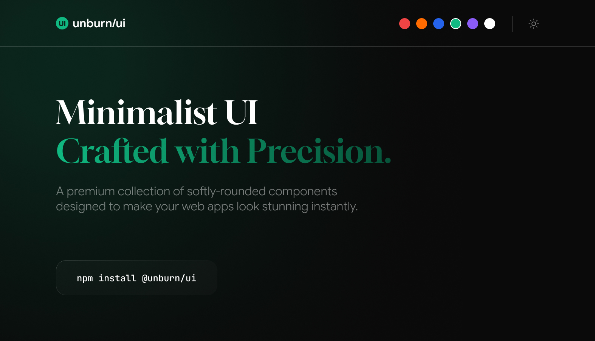

# [unburn/ui](https://ui.unburn.tech)

**Minimalist UI Crafted with Precision.**

@unburn/ui is a premium React component library built with a focus on "Soft Geometry" and high-performance design. It provides a collection of beautifully designed, softly-rounded components that help you build stunning web applications instantly.

## 🎨 Design Guidelines

For a deep dive into our design philosophy, check out our [DESIGN.md](DESIGN.md).

## 🤝 Contributing

We welcome contributions! Please see our [CONTRIBUTING.md](CONTRIBUTING.md) to get started.

## 📄 License

This project is licensed under the MIT License - see the [LICENSE](LICENSE) file for details.